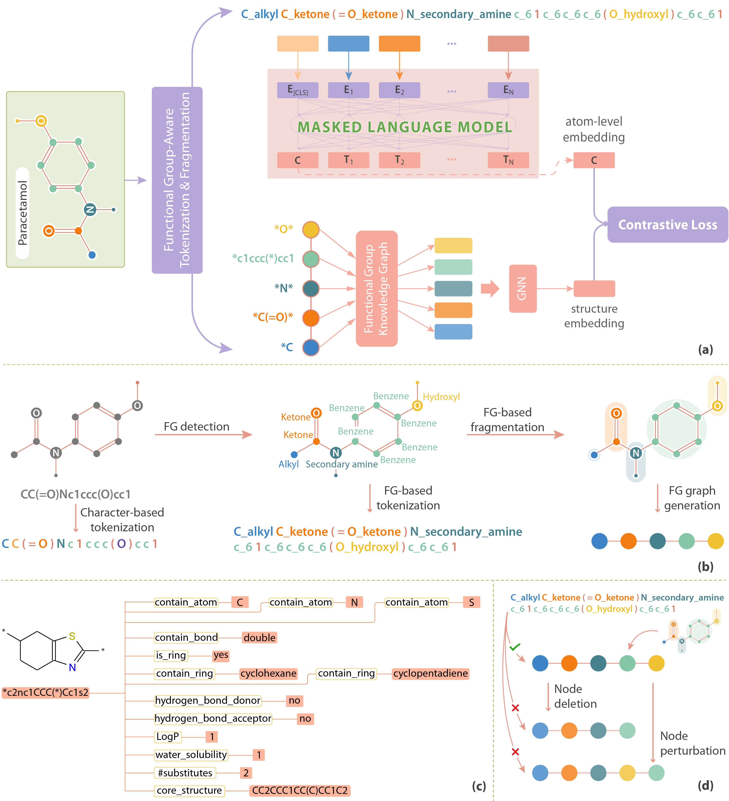

# FARM for Molecular Representation
Source code for the paper **FARM: Functional Group-Aware Representations for Small Molecules** [paper](https://arxiv.org/pdf/2410.02082) [webpage](https://thaonguyen217.github.io/farm/)


## Structure of the Repository

The repository is organized into the following directories:

### Directories Description

- **data/**: Contains scripts for downloading datasets.
  - `download_big_corpus.py`: Script to download a large molecular corpus.
  - `download_small_corpus.py`: Script to download a smaller molecular corpus.

- **downstream_tasks/**: Contains scripts for downstream tasks related to molecular representation.
  - `(0)scaffold_split.py`: Script for splitting data based on scaffolds.
  - `(1)classifier.py`: Script for training a classifier on molecular data.
  - `(2)regressor.py`: Script for training a regressor on molecular data.

- **src/**: Contains the source code and utility scripts for processing molecular data and training models.
  - `helpers.py`: Helper functions for various tasks.
  - `(1)clean_smiles.py`: Script for cleaning SMILES strings.
  - `(2)gen_FG_enhanced_SMILES.py`: Script for generating functional group enhanced SMILES.
  - `(3)train_tokenizer.py`: Script for training a tokenizer on molecular data.
  - `(4)train_bert.py`: Script for training a BERT model for molecular representation.
  - `(5)gen_FG_vocab.py`: Script for generating a vocabulary for functional groups.
  - `(6)gen_FG_KG.py`: Script for generating a knowledge graph based on functional groups.
  - `(7)train_FG_KGE.py`: Script for training a functional group knowledge embedding.
  - `(8)gen_FG_molecular_graph.py`: Script for generating molecular graphs based on functional groups.
  - `(9)train_GCN_link_prediction.py`: Script for training a GCN model for link prediction.
  - `(10)gen_contrastive_learning_data.py`: Script for generating data for contrastive learning.
  - `(11)train_contrastive_bert.py`: Script for training a contrastive BERT model.

## Installation

To install the required packages, please run:

```bash
pip install -r requirements.txt
```

## Use FARM to Extract Molecule Embeddings for Target Dataset
### Step 1: Clean Data
To clean the dataset by removing invalid SMILES and converting SMILES to canonical SMILES, run the `(1)clean_smiles.py` script. This script requires two arguments:
- `csv_data_path`: The path to the input CSV file containing SMILES.
- `save_smiles_path`: The path to save the cleaned SMILES CSV file.
**Example**:
```bash
python clean_smiles.py --csv_data_path path/to/input.csv --save_smiles_path path/to/cleaned_smiles.csv
```
*Note: The input CSV file must contain a column named "SMILES".*

### Step 2: Generate FG-Enhanced SMILES
To generate FG-enhanced SMILES, run the `gen_FG_enhanced_SMILES.py` script. This script requires:
- `csv_path`: The path to the input CSV file containing molecule data.
- `save_path`: The path to save the output pickle file.
**Example**:
```bash
python gen_FG_enhanced_SMILES.py --csv_path path/to/cleaned_smiles.csv --save_path path/to/fg_enhanced_smiles.pkl
```

### Step 3: Download Model and Extract Molecular Embeddings
To extract molecular embeddings for FG-enhanced SMILES, you can use the Hugging Face model. Here’s how to do it in Python:
```python
from transformers import BertForMaskedLM, PreTrainedTokenizerFast

# Load the tokenizer and model
tokenizer = PreTrainedTokenizerFast.from_pretrained('thaonguyen217/farm_molecular_representation')
model = BertForMaskedLM.from_pretrained('thaonguyen217/farm_molecular_representation')

# Example usage
input_text = "N_primary_amine N_secondary_amine c_6-6 1 n_6-6 n_6-6 c_6-6 c_6-6 2 c_6-6 c_6-6 c_6-6 c_6-6 c_6-6 1 2"  # FG-enhanced representation of NNc1nncc2ccccc12
inputs = tokenizer(input_text, return_tensors='pt')
outputs = model(**inputs, output_hidden_states=True)

# Extract atom embeddings from last hidden states
last_hidden_states = outputs.hidden_states[-1][0]  # last_hidden_states: (N, 768) where N is the input length
```


## Train Baseline BERT Model from Scratch
This section guides you step by step to train a baseline BERT model that uses masked language modeling to implicitly learn the syntax and semantics of FG-enhanced SMILES. This model serves as a baseline for FARM.

### Step 1: Clean SMILES
(As presented above)

### Step 2: Generate FG-Enhanced SMILES
(As presented above)

*Note: You can also download a pre-collected dataset by running `data/download_small_corpus.py` or `data/download_big_corpus.py`. These corpora contain ~20M and 200M FG-enhanced SMILES, respectively. For more details about the collected dataset, please refer to our [paper](https://arxiv.org/pdf/2410.02082).*

### Step 3: Train a Tokenizer for FG-Enhanced SMILES
Train a tokenizer for FG-enhanced SMILES by running `train_tokenizer.py`. This requires two arguments:
- `corpus_path`: The path to the text corpus generated from Step 2 for training the tokenizer.
- `save_path`: The directory to save the trained tokenizer.
**Example**:
```bash
python train_tokenizer.py --corpus_path path/to/fg_enhanced_corpus.txt --save_path path/to/tokenizer_directory
```

### Train a BERT Model for Masked Language Modeling
Train a `BertForMaskedLM` model by running `train_bert.py` with the following arguments:
- `train_corpus_path` and `val_corpus_path`: Path to the training and validation corpora (obtained from Step 2).
- `tokenizer_path`: Path to the tokenizer (obtained from Step 3).
- `pretrained_model`: Path to the pretrained BERT model.
**Example**:
```bash
python train_bert.py --train_corpus_path path/to/train_corpus.txt --val_corpus_path path/to/val_corpus.txt --tokenizer_path path/to/tokenizer --pretrained_model path/to/pretrained_bert
```


## Train FARM from Scratch
Training FARM from scratch involves two major steps:

1. Molecular structure learning.
2. Contrastive learning to align atom-level representation with structure-level representation.
### Step 1: Molecular Structure Learning
This step includes smaller tasks:
#### 1.1 Clean SMILES and generate FG-enhanced SMILES (as presented above).
#### 1.2 Generate a vocabulary of all functional groups by running `gen_FG_vocab.py` with the following arguments:
- `input_csv`: Path to the input CSV file containing a column 'SMILES'.
- `output_pkl`: Path to the output pickle file for storing the functional groups vocabulary.
**Example**:
```bash
python gen_FG_vocab.py --input_csv path/to/molecules.csv --output_pkl path/to/fg_vocab.pkl
```

#### 1.3 Generate the functional group knowledge graph (FGKG) by running `gen_FG_KG.py` with these arguments:
- `vocab_path`: Path to the FG vocabulary file (obtained from the last step).
- `FGKG_path`: Path to save the FG knowledge graph (as a pickle file).
**Example**:
```bash
python gen_FG_KG.py --vocab_path path/to/fg_vocab.pkl --FGKG_path path/to/fgkg.pkl
```

#### 1.4 Train the knowledge graph embedding model (KGE) to learn representations of functional groups by running `train_FG_KGE.py`:
- `FGKG_path`: Path to the FG knowledge graph (obtained from the last step).
- `checkpoint`: Path to save model checkpoints.
- `feature_dict_path`: Path to save the `feature: FG_embedding` dictionary (as a pickle file).
**Example**:
```bash
python train_FG_KGE.py --FGKG_path path/to/fgkg.pkl --checkpoint path/to/checkpoints --feature_dict_path path/to/feature_dict.pkl
```

#### 1.5 Generate a functional group molecular graph by running `gen_FG_molecular_graph.py`:
- `csv_path`: Path to the input CSV file containing SMILES.
- `feature_path`: Path to the KGE functional group embedding file (obtained from the last step).
- `save_path`: Path to save the processed graph structure data.
**Example**:
```bash
python gen_FG_molecular_graph.py --csv_path path/to/molecules.csv --feature_path path/to/fg_embeddings.pkl --save_path path/to/fg_molecular_graph.pkl
```

#### 1.6 Train a GCN model for link prediction using self-supervised learning by running `train_GCN_link_prediction.py`:
- `data_path`: Path to the FG molecular graph dataset (pickle file obtained from the last step).
- `checkpoint_path`: Path to save model checkpoints.
**Example**:
```bash
python train_GCN_link_prediction.py --data_path path/to/fg_molecular_graph.pkl --checkpoint_path path/to/checkpoints.pth
```
The molecular embeddings learned by this model capture *structural information* about how functional groups are bonded within a molecule.

### Step 2: Contrastive Learning to Align Atom-Level and Structure-Level Representations
#### 2.1 Generate data for contrastive learning
Each data point for contrastive learning is a triplet `(FG-enhanced SMILES, pos, neg)`. Here, `pos` is the corresponding FG graph embedding of the SMILES, and `neg` is an embedding of augmented FG graph of the SMILES. To generate the triplet data, run `gen_contrastive_learning_data.py`:
- `link_prediction_model`: Path to the link prediction model checkpoint.
- `fgkg_embedding_path`: Path to the feature dictionary pickle file (obtained from the KGE model).
- `corpus_path`: Path to the input corpus CSV file.
- `save_path`: Path to save the output pickle file for training the contrastive BERT model.
**Example**:
```bash
python gen_contrastive_learning_data.py --link_prediction_model path/to/link_prediction_model --fgkg_embedding_path path/to/feature_dict.pkl --corpus_path path/to/corpus.csv --save_path path/to/contrastive_data.pkl
```

#### 2.2 Train the Contrastive BERT model by running `train_contrastive_bert.py`:
- `train_corpus_path` and `val_corpus_path`: Path to the training and validation corpora (obtained from the last step).
- `tokenizer_path`: Path to the FM-enhanced SMILES tokenizer.
- `pretrained_model_path`: Path to the pretrained BERT model (optional).
- `output_dir`: Directory to save the output model and tokenizer.