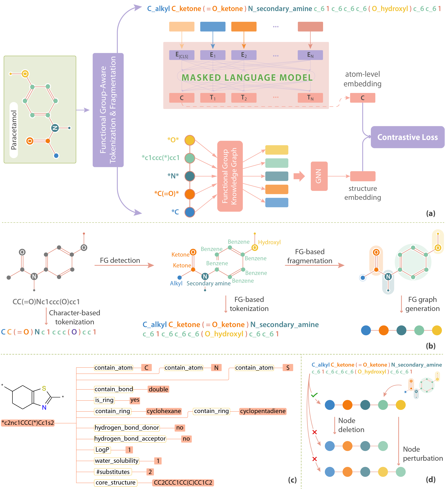

# FARM for Molecular Representaion
Source code for the paper **FARM: Functional Group-Aware Representations for Small Molecules** [paper](https://arxiv.org/pdf/2410.02082) [webpage](https://thaonguyen217.github.io/farm/)


## Structure of the Repository

The repository is organized into the following directories:

### Directories Description

- **data/**: Contains scripts for downloading datasets.
  - `download_big_corpus.py`: Script to download a large molecular corpus.
  - `download_small_corpus.py`: Script to download a smaller molecular corpus.

- **downstream_tasks/**: Contains scripts for downstream tasks related to molecular representation.
  - `(0)scaffold_split.py`: Script for splitting data based on scaffolds.
  - `(1)classifier.py`: Script for training a classifier on molecular data.
  - `(2)regressor.py`: Script for training a regressor on molecular data.

- **src/**: Contains the source code and utility scripts for processing molecular data and training models.
  - `helpers.py`: Helper functions for various tasks.
  - `(1)clean_smiles.py`: Script for cleaning SMILES strings.
  - `(2)gen_FG_enhanced_SMILES.py`: Script for generating functional group enhanced SMILES.
  - `(3)train_tokenizer.py`: Script for training a tokenizer on molecular data.
  - `(4)train_bert.py`: Script for training a BERT model for molecular representation.
  - `(5)gen_FG_vocab.py`: Script for generating a vocabulary for functional groups.
  - `(6)gen_FG_KG.py`: Script for generating a knowledge graph based on functional groups.
  - `(7)train_FG_KGE.py`: Script for training a functional group knowledge embedding.
  - `(8)gen_FG_molecular_graph.py`: Script for generating molecular graphs based on functional groups.
  - `(9)train_GCN_link_prediction.py`: Script for training a GCN model for link prediction.
  - `(10)gen_contrastive_learning_data.py`: Script for generating data for contrastive learning.
  - `(11)train_contrastive_bert.py`: Script for training a contrastive BERT model.

## Installation

To install the required packages, please run:

```bash
pip install -r requirements.txt
